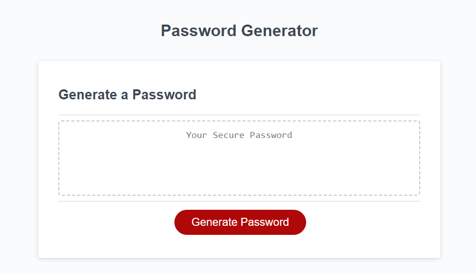
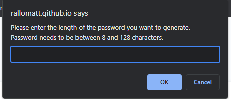
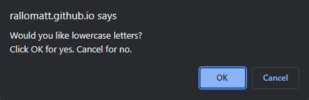
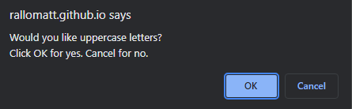
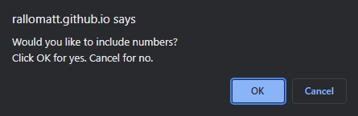
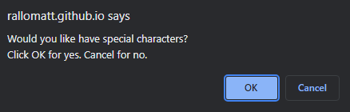
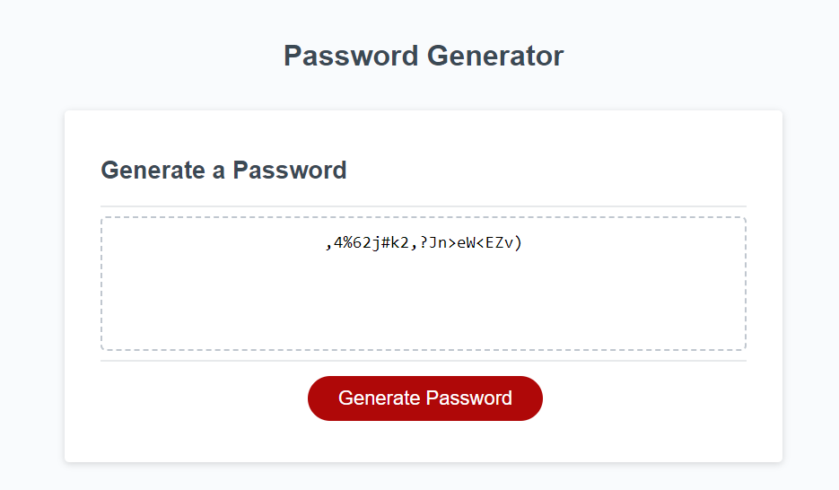

# Password Generator

## Description

A backend project that uses javascript prompts for user input. When user clicks generate password button, javascript is used to show prompts and verify user input. This input is then used to generate a random password. Input is determined by reading text and button clicks. It also verifies user input. 

## Usage

User should click generate password. Then a prompt shows up. User then needs to enter the length of password they prefer. Afterwards, to determine what character types user wants, user clicks ok for yes and cancel for no. This then produces a password based up what the user wants. The password is displayed in the text area on the HTML page. 

## Website URL

https://rallomatt.github.io/passwordGenerator/

## Screenshots

## Credits

HTML code was given to me by WASHU coding bootcamp.

## License

Please refer to the LICENSE in the repo.